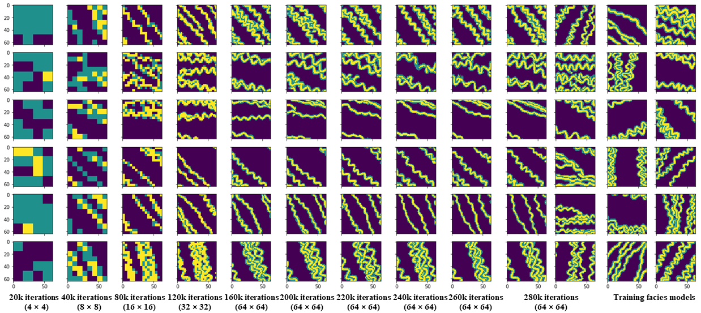
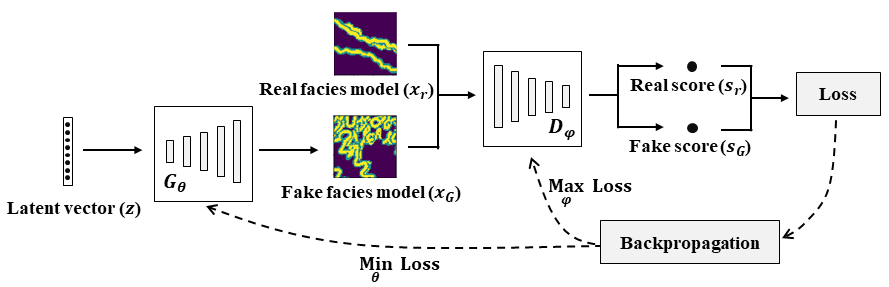
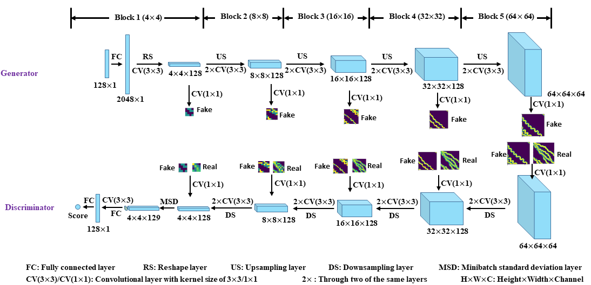

## Unconditional Geological Facies Modeling Based on Progressive Growing of GANs


 
**Picture:** *These facies models are produced by generator during the progressive training process.*

This repository contains the official TensorFlow implementation of the following paper:

> **Geological Facies Modeling Based on Progressive Growing of Generative Adversarial Networks (GANs)**<br>
> Suihong Song (CUPB & Stanford), Tapan Mukerji (Stanford), and Jiagen Hou (CUPB)<br>
> CUPB: China University of Petroleum - Beijing

> https://eartharxiv.org/ycufs/
>
> **Abstract:** *Geological facies modeling has long been studied to predict subsurface resources. In recent years, generative adversarial networks (GANs) have been used as a new method for geological facies modeling with surprisingly good results. However, in conventional GANs, all layers are trained concurrently, and the scales of the geological features are not considered. In this study, we propose to train GANs for facies modeling based on a new training process, namely progressive growing of GANs or a progressive training process. In the progressive training process, GANs are trained layer by layer, and geological features are learned from coarse scales to fine scales. We also train a GAN in the conventional training process, and compare the conventionally trained generator with the progressively trained generator based on visual inspection, multi-scale sliced Wasserstein distance (MS-SWD), multi-dimensional scaling (MDS) plot visualization, facies proportion, variogram, and channel sinuosity and width metrics. The MS-SWD reveals realism and diversity of the generated facies models, and is combined with MDS to visualize the relationship between the distributions of the generated and training facies models. The conventionally and progressively trained generators both have very good performances on all metrics. The progressively trained generator behaves especially better than the conventionally trained generator on the MS-SWD, MDS plots, and the facies proportion metrics. The training time for the progressively trained generator is much less (39.2%) than that for the conventionally trained generator. This study demonstrates the superiority of the progressive training process over the conventional one in geological facies modeling, and provides a better option for future GAN-related researches.*

For any question, please contact [songsuihong@126.com]<br>


 

**Picture:** *Basic workflow of GANs for facies modeling.*


 

**Picture:** *GAN architecture used in this study; GAN is trained block (of layers) by block with progressively enlarging training facies models.*


## Resources

Material related to our paper is available via the following links:

- Paper: https://eartharxiv.org/ycufs/
- Code: (Github) https://github.com/SuihongSong/GeoModeling_Conditional_ProGAN
- Training dataset: (Zenodo) https://zenodo.org/record/3993800#.X1BwqchKhaR
- Pre-trained GANs: (Zenodo) https://zenodo.org/record/3993800#.X1BwqchKhaR, or (Google Drive) conventional generator: https://drive.google.com/file/d/1eAolkBKhVCXdkviXkL6BTdYJujXUj8iP/view?usp=sharing; progressive generator: https://drive.google.com/file/d/1jfWFEC1TDrtWbYrJvCkz_nPbcVanKVF6/view?usp=sharing) 

## Licenses

All material, including our training dataset, is made available under MIT license. You can **use, redistribute, and adapt** the material for **non-commercial purposes**, as long as you give appropriate credit by **citing our paper** and **indicating any changes** that you've made.

## System requirements

* Both Linux and Windows are supported, but Linux is suggested.
* 64-bit Python 3.6 installation. We recommend Anaconda3 with numpy 1.14.3 or newer.
* TensorFlow 1.10.0 or newer with GPU support.
* One or more high-end NVIDIA GPUs. 
* NVIDIA driver 391.35 or newer, CUDA toolkit 9.0 or newer, cuDNN 7.4.1 or newer.

## Using pre-trained networks

We trained GANs with both the conventional training method (all layers are trained concurrently) and the progressive training method (GANs are trained layer by layer), thus two GAN networks (conventionally trained and progressively trained) are finally obtained. The trained networks are stored in Zenodo (https://zenodo.org/record/3993800#.Xz8P-shKhaQ) or Google Drive (conventional https://drive.google.com/file/d/1eAolkBKhVCXdkviXkL6BTdYJujXUj8iP/view?usp=sharing; progressive https://drive.google.com/file/d/1jfWFEC1TDrtWbYrJvCkz_nPbcVanKVF6/view?usp=sharing).

A minimal example of using a pre-trained generator (either conventionally or progressively trained) is given in [pretrained_example.ipynb](./Code/pretrained_example.ipynb). 
To run pretrained_example.ipynb on local computer, please download all code files from this Github repository (https://github.com/SuihongSong/GeoModeling_Conditional_ProGAN), also download pre-trained generators from zenodo or my google drive. 
pretrained_example.ipynb can also be run on Colab, where the pre-trained generators can be downloaded into Colab from my google drive with 
```
!gdown --id 1eAolkBKhVCXdkviXkL6BTdYJujXUj8iP # download conventionally trained GAN
!gdown --id 1jfWFEC1TDrtWbYrJvCkz_nPbcVanKVF6 # download progressively trained GAN
```

The pre-trained GAN networks are stored as standard pickle files:
```
# pre-trained generator directory path; please replace it with your own path.
network_dir = '/scratch/users/suihong/ProGAN_MultiChannel_Reusults_ConditionedtoMultiConditions_TF/Unconditional_prog/'

# replace with downloaded pre-trained generator name.
with open(network_dir + 'network-snapshot-011520.pkl', 'rb') as file:
G, D, Gs = pickle.load(file)
    # G = Instantaneous snapshot of the generator. Mainly useful for resuming a previous training run.
    # D = Instantaneous snapshot of the discriminator. Mainly useful for resuming a previous training run.
    # Gs = Long-term average of the generator. Yields higher-quality results than the instantaneous snapshot.
```

The above code unpickles pre-trained GAN networks to yield 3 instances of networks. To generate facies models, you will want to use `Gs` or `G`. The exact details of the generator and discriminator are defined in [networks.py](./Code/networks.py) (see ` G_paper `, and ` D_paper `). 

The input of generator contains latent vectors with 128 dimension and labels with 0 dimension. Thus, labels have no controlling effect on the produced facies models. We don’t cast away this labels input, because it is used in another conditional facies modeling research (see my next repository https://github.com/SuihongSong/GeoModeling_Conditional_ProGAN).

## Training dataset

The training dataset (training facies models) is stored as multi-resolution TFRecords. Each original facies model (64x64) is downsampled into multiple resolutions (32x32, …, 4x4) and stored in \*.tfrecords files for efficient streaming during training. There is a separate \*.tfrecords file for each resolution. The training dataset also includes a label file (\*.labels), but this file is actually not used in this unconditional facies modeling case. 

### How to make training data as TFRecords?

(1) In our study, we synthesize training facies models using object-based method in Petrel software, and export them into one file as model properties with `"Gslib"` format. An Gslib format example of the exported file is [Format_example_of_simulated_facies_models_from_Petrel.txt](./Code/Format_example_of_simulated_facies_models_from_Petrel.txt).

First lines of the exported file are like:

PETREL: Properties

17820 % Number of synthesized facies models

Facies unit1 scale1

Facies unit1 scale1

...

Facies unit1 scale1

% Totally, there are 64x64 lines, corresponding to 64x64 pixels in each facies model; each line has 17820 numbers splitted by space, corresponding to 17820 facies code values of 17820 generated facies realizations at each pixel. 0-background mud faceis, 1-channel sand facies, 2-channel bank facies.

0.000000 0.000000 0.000000 0.000000 0.000000 0.000000 ... 0.000000 1.000000 2.000000

0.000000 1.000000 0.000000 0.000000 0.000000 0.000000 ... 0.000000 0.000000 0.000000

...

0.000000 0.000000 0.000000 0.000000 0.000000 0.000000 ... 0.000000 0.000000 0.000000


(2) This exported file containing synthesized facies models is read in [Preparing_training_and_test_datasets.ipynb](./Code/Preparing_training_and_test_datasets.ipynb). The data in the file is rearranged into `(FaciesModelNumber, 1, 64, 64)`. 

In our study, when synthesizing facies models in Petrel, we only consider orientation of channels varying from 0 to 90 degrees, thus in [Preparing_training_and_test_datasets.ipynb](./Code/Preparing_training_and_test_datasets.ipynb), we further enlarge the facies model dataset by reversing the synthesized facies mdoels vertically whose orientation become from -90 to 0 degrees:
```
allimgs = np.concatenate((partimgs, partimgs[::-1,:,:]),2)
```
Other software, like SGeMS, can also be used to simulate the training facies models, as long as the final generated facies models are arranged into `(FaciesModelNumber, 1, 64, 64)`.

Global features (also called labels) are arranged into `(FaciesModelNumber, GlobalFeaturesNumber)`.

(3) [Preparing_training_and_test_datasets.ipynb](./Code/Preparing_training_and_test_datasets.ipynb) also includes code on how to generate probability maps and well facies data from synthesized facies models, but these are not needed in this case of unconditional facies modeling. Thus, readers can skip these parts of codes, and just `1 Write paths`, `2 Load facies models`, `5 Load labels (Global features)`, and `6 Generate training and test datasets`. In `6 Generate training and test datasets`, as test dataset is not needed either, readers can just set all facies models as training dataset, and only write training dataset as TFrecords:
```
randseq=np.random.RandomState(232).permutation(allimgs.shape[0])
allimgs_training = allimgs[randseq]
labels_cor_training = labels_cor[randseq]
with TFRecordExporter(tfrecord_dir_training, allimgs_training.shape[0]) as tfr:
    order = tfr.choose_shuffled_order()
    for idx in range(order.size):
        tfr.add_real_image(allimgs_training[order[idx]])
    tfr.add_labels(labels_cor_training[order])    
```

## Training networks

Once the training dataset and related codes are downloaded, you can train your own facies model generators as follows:

1. Edit [config.py](./Code/config.py) to set path for the downloaded training data and path for expected results, and other hyperparameters like gpu number. If using conventional GAN training process, uncomment the line of code: 
```
#desc += '-nogrowing'; sched.lod_initial_resolution = 64; train.total_kimg = 10000
```
2. Edit [train.py](./Code/train.py) to set detailed parameters of training, such as parameters in `class TrainingSchedule` and `def train_progressive_gan`.

3. Set default path as the directory path of downloaded code files, and run the training script with `python train.py`. Or, edit path in [RunCode.ipynb](./Code/RunCode.ipynb), and run `% run train.py` in [RunCode.ipynb](./Code/RunCode.ipynb) with Jupyter notebook.

## Assessment of the trained generator during or after training

(1) Visual assessment by comparing randomly generated facies models with training facies models: see [pretrained_example.ipynb](./Code/pretrained_example.ipynb).

(2) To calculate multi-scale sliced Wasserstein distance (MS-SWD) values for different networks during training, distribution of facies models in MDS plot based on MS-SWD for different networks during training, or comparison of facies models produced by conventionally and progressively trained generators against training facies models at the same MDS plot:

First, uncomment corresponding line of code in the last code block in [config.py](./Code/config.py). 

Second, if try with our trained generators, please modify “data_dir” and “result_dir” parameters in downloaded “config.txt” (Zenodo https://zenodo.org/record/3993800#.Xz8P-shKhaQ). 

Finally, run code in [RunCode.ipynb](./Code/RunCode.ipynb) file. 

(3) Variograms: see [Variogram_Ploting.ipynb](./Code/Variogram_Ploting.ipynb). 

(4) Statistics for channel sinuosity and width: run matlab code [AnalysesofChannelSinuosityandWidth.m](./Code/AnalysesofChannelSinuosityandWidth.m) to calculate channel sinuosity and channel width for each facies model. When running the code, every time when one facies model pops up, select one channel that is representative of the facies model, and double click the channel, then it will pop up next facies model. During this process, “endpoints”, “startpoints”, “reallengths” (arclength), and “widths” (half width) can be calculated, thus the sinuosity (arclength/straight-line length) and width of double-clicked channels can be calculated.

Please note that the exact results may vary from run to run due to the non-deterministic nature of TensorFlow.

## Acknowledgements

Code for this project is improved from the original code of Progressive GANs (https://github.com/tkarras/progressive_growing_of_gans). We thank the authors for their great job.
